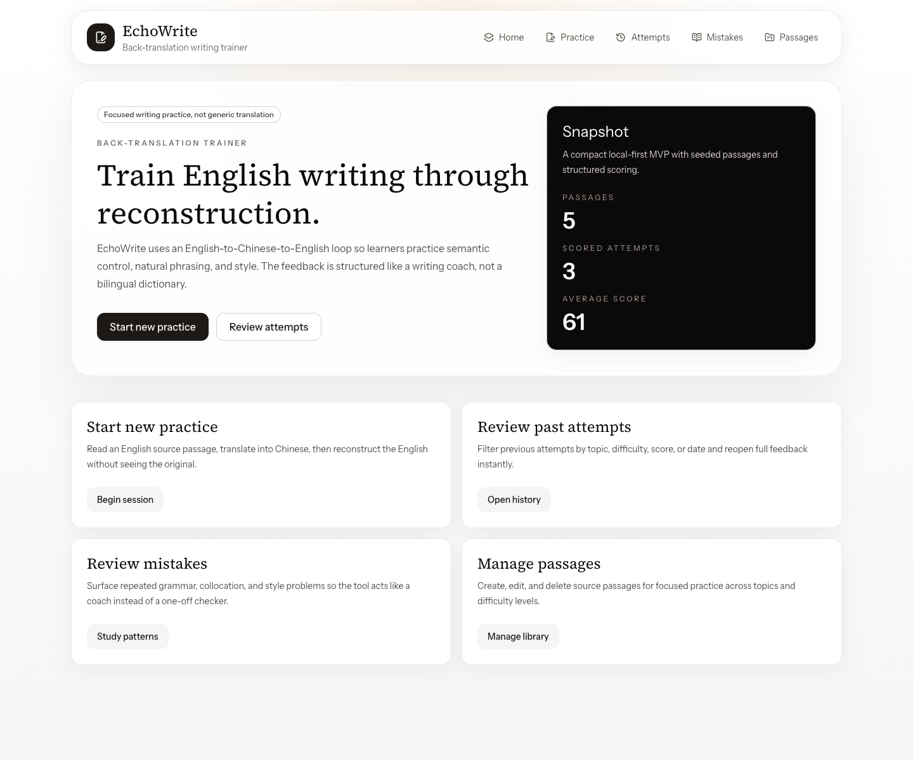
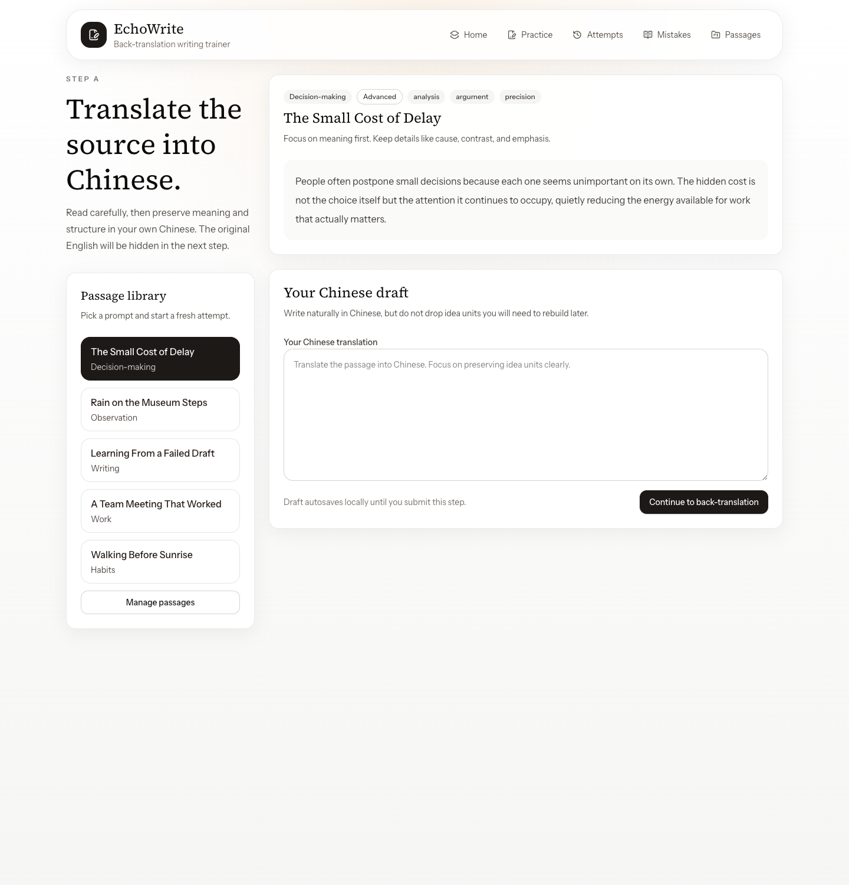
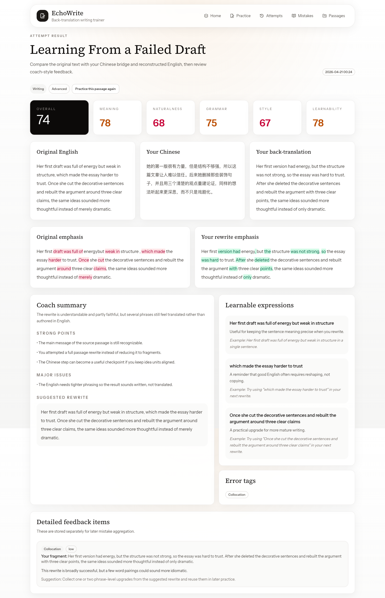
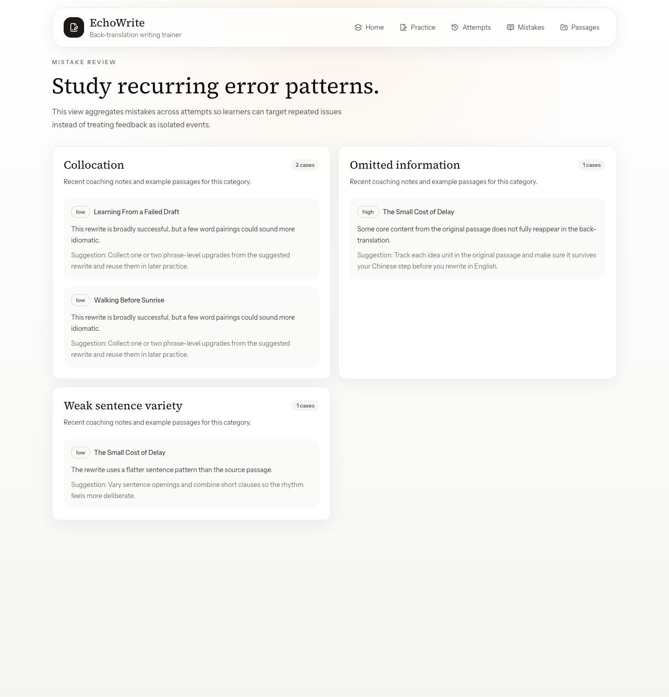
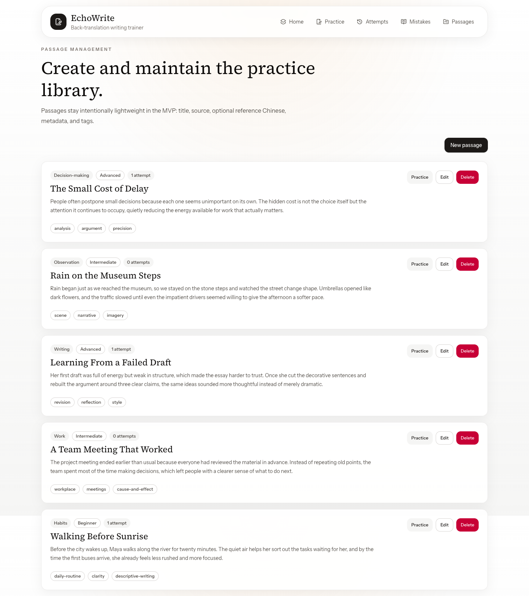

# EchoWrite

EchoWrite is a production-style MVP for a back-translation writing trainer. It helps users practice English writing by reconstructing English from their own Chinese translation, then reviewing structured coaching feedback focused on writing quality rather than literal translation.

## Screenshots

### Home



### Practice flow



### Attempt feedback



### Mistake review



### Passage library



## Stack

- Next.js App Router
- TypeScript
- Tailwind CSS
- shadcn-style component layer
- Prisma + SQLite
- Zod
- OpenAI server-side evaluator with a mock fallback

## Architecture

- `app/`: App Router pages, server actions, and the `/api/evaluate` route.
- `components/`: UI primitives, page scaffolding, forms, and result renderers.
- `lib/db.ts`: Prisma client singleton.
- `lib/evaluator/`: evaluator abstraction, mock heuristics, OpenAI prompt, and service entrypoint.
- `lib/validators/`: Zod schemas for passages, attempts, and evaluation payloads.
- `prisma/`: schema plus seed script with demo passages and sample attempts.
- `scripts/`: local helper script for resetting the database.

## MVP Scope

Implemented:

- Home page with clear entry points
- New practice flow
  - Step A: source English to Chinese
  - Step B: Chinese to back-translated English
  - Step C: scored results with structured feedback and text diff
- Passage CRUD
- Attempt history with filters
- Mistake aggregation by category
- Mock evaluator for local development
- OpenAI evaluator behind `EVALUATOR_MODE=openai`
- Seeded demo data

Not included:

- Auth
- Collaboration
- Payment
- Background jobs
- Advanced analytics dashboards

## Local Setup

1. Install dependencies:

```bash
npm install
```

2. Copy the environment file:

```bash
cp .env.example .env
```

3. Create the SQLite database and seed demo content:

```bash
npm run db:push
npm run db:seed
```

4. Start the dev server:

```bash
npm run dev
```

Open [http://localhost:3000](http://localhost:3000).

## Evaluator Modes

### Mock mode

Default local mode:

```env
EVALUATOR_MODE=mock
```

This returns deterministic structured feedback without an API key.

### OpenAI mode

Set these in `.env`:

```env
EVALUATOR_MODE=openai
OPENAI_API_KEY=your_key_here
OPENAI_MODEL=gpt-5.2
```

The evaluator is called server-side and validates model output with Zod. If the model response is malformed or the request fails, the app falls back to mock evaluation so the MVP remains usable.

## Useful Commands

```bash
npm run dev
npm run lint
npm run typecheck
npm run db:generate
npm run db:push
npm run db:seed
npm run db:reset
```

## Notes

- Tags are stored as a JSON array in SQLite for MVP simplicity.
- Attempts keep a snapshot of `evaluationJson` plus denormalized numeric scores for filtering.
- Mistakes are materialized into a dedicated table so recurring patterns can be aggregated quickly.
